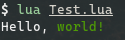
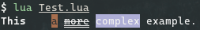

# TermColors

Colorize the output of your Lua scripts with TermColors like:

```lua
local tc = require("TermColors")
local my_string = "Hello, #{FG(Green)}world!#{None}"

tc:print(my_string)
```

And output like this:



But that is a simple example. You can make a more complex output like this:

```lua
local tc = require("TermColors")
local my_string = "#{Bold}This#{None} #{Blink; Italic}is#{None} #{Reverse; FG(RGB(167, 110, 78))}a#{None} #{DobleU; Strike}more#{None} #{BG(146)}complex#{None} example."

tc:print(my_string)
```

Output:



The word "is" have's the "Blink" effect, so you can't see in the capture.

### Usage

Using TermColors is really simple, you only need put the output properties inside of `#{}`, separating each one using a semicolon (;) and TermColors make the rest. TermColors allow the following properties:

  - "Effects":
    * None (reset all properties)
    * Bold
    * Dim
    * Italic
    * Underline
    * Blink
    * Reverse
    * Hidden
    * Strike
    * DobleU ("Doble Underline")
  - Colors: you can use colors only with `FG()` (Foreground) and `BG()` (Background) functions.
    * Black
    * Red
    * Green
    * Yellow
    * Blue
    * Magenta
    * Cyan
    * White

`FG()` and `BG()` functions take 3 types of arguments and only 1 of each it:
  1. A predefined color (one of you see in the above list). [Read this][1]
  2. A number from 0 to 255. [Read this][2]
  3. A RGB value using the `RGB()` function. [Read this][3]

TermColors is case-sensitive. TermColors know that `FG` is a function for foreground colors, but `fg` is another thing. Also, TermColors provide 2 functions/methods:

  1. `compile()`: take an string, convert all `#{}` groups into a ANSI escape code and returns the result string.
  2. `print()`: take an string, pass it to `compile()` and prints it directly.

Of course, if you want to use manually ANSI codes, TermColors provide:

  - `TermColors.ESC`: the character for colored output (`0x1b`).
  - `TermColors.Attr`: maybe the name is not correct, but basically contains the number code for output "effects".
  - `TermColors.FG`: contains predefined colors (see the first list). You can use it like:
    ```lua
    local tc = require("TermColors")
    local my_string = tc.ESC .. "[" .. tc.FG.Green .. "mTesting!" .. tc.ESC .. "[" .. tc.Attr.None
    print(my_string)
    ```
  - `TermColors.BG`: same as `FG` but for background colors.

__Is very important to separate properties with a semicolon (please read "Limitations" below).__

### Limitations

If you don't use semicolons properly, the output maybe wrong because the code behinds TermColors is actually simple and don't check this details. The same case if for when you put various semicolons with no properties between each one. Maybe there's others limitations, but I only know these.

Of course, this things are in "TODO" and I want to improve this library.

### Sources

I made this using the info provide by Wikipedia in [this article][4]

[1]: https://en.wikipedia.org/wiki/ANSI_escape_code#3/4_bit
[2]: https://en.wikipedia.org/wiki/ANSI_escape_code#8-bit
[3]: https://en.wikipedia.org/wiki/ANSI_escape_code#24-bit
[4]: https://en.wikipedia.org/wiki/ANSI_escape_code